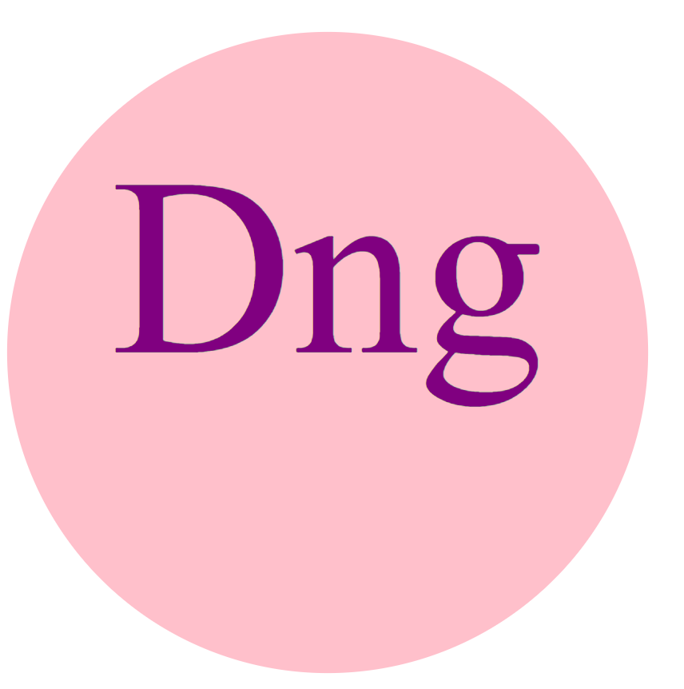

# SVG Logo Maker

## Description

This application uses Node.js to create logo using any three charaters of you choice.

## Table of Contents

- [Installation](#installation)
- [Usage](#usage)
- [License](#license)
- [Questions](#questions)

## Installation

N/A

## Usage

N/A

## License

This project is licensed under the MIT license. See the [LICENSE](https://opensource.org/licenses/MIT) file for details.

## Links

- Demo Video: https://drive.google.com/file/d/1g8l5QOEBtsn-Q49c77ERyACS79MoE7C0/view

## Tests

N/A

## Image:

## Questions

If you have any questions about the project, please feel free to contact me on [GitHub](https://github.com/undefined) or by [email](mailto:daningore11@gmail.com).
